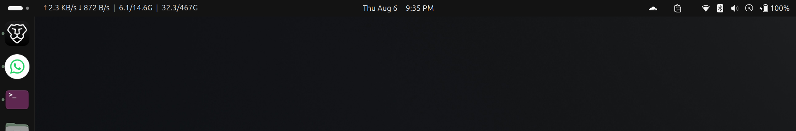
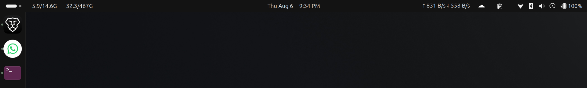
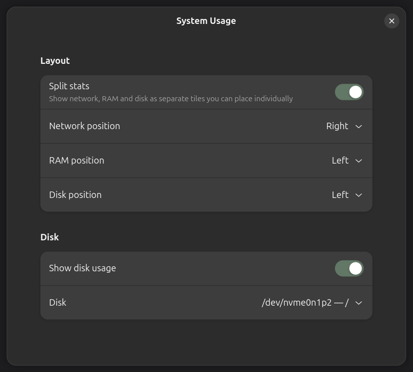

# System Usage

Network speed, RAM and disk usage in the GNOME top bar.



Or split, each tile placed on its own side of the panel.



## Why

Most panel monitors sum every interface in `/proc/net/dev`. With a VPN or Docker
running, the same bytes are counted on the tunnel and again on the physical NIC,
so a real 2.5 MB/s reads as about 6 MB/s.

This one counts only interfaces backed by hardware, the ones with a
`/sys/class/net/<if>/device` link.

## Settings



## Install

Requires GNOME Shell 50.

```sh
git clone https://github.com/legitcoconut/gnome-system-stats
ln -s "$PWD/gnome-system-stats" \
  ~/.local/share/gnome-shell/extensions/system-usage@legitcoconut
glib-compile-schemas \
  ~/.local/share/gnome-shell/extensions/system-usage@legitcoconut/schemas
gnome-extensions enable system-usage@legitcoconut
```

Log out and back in on Wayland, or `Alt+F2` then `r` on X11.

## License

GPL-2.0-or-later
